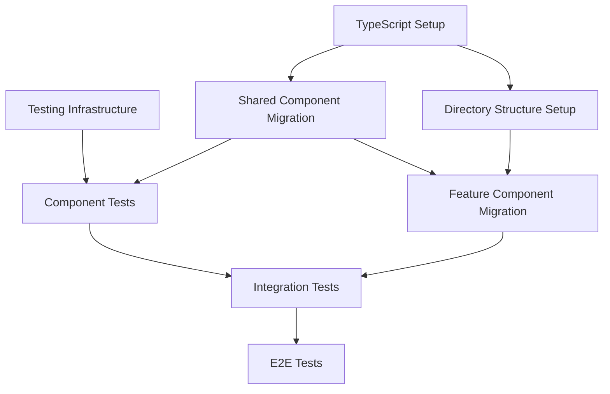

# Project Modernization Execution Strategy

## Overview

This document outlines the execution strategy for implementing the three high-priority improvements:
1. TypeScript Migration
2. Component Restructuring
3. Testing Implementation

## Implementation Order and Timeline

### Phase 1: Foundation (Week 1-2)
- Set up TypeScript configuration
- Create new directory structure
- Set up testing infrastructure
- Team training on new tools and patterns

### Phase 2: Shared Components (Week 3-4)
- Migrate shared components to TypeScript
- Move components to new structure
- Implement component tests
- Set up CI/CD for testing

### Phase 3: Feature Components (Week 5-6)
- Migrate feature components to TypeScript
- Restructure feature directories
- Implement feature-level tests
- Add integration tests

### Phase 4: Refinement (Week 7-8)
- Add E2E tests
- Performance optimization
- Documentation updates
- Final adjustments

## Dependencies and Relationships

## Risk Mitigation

### 1. Technical Risks
- Maintain parallel JavaScript build process
- Implement changes in small, reversible chunks
- Regular testing and validation
- Comprehensive rollback plans

### 2. Team Risks
- Early team training
- Regular knowledge sharing
- Pair programming sessions
- Clear documentation

## Quality Gates

### 1. TypeScript Migration
- All files properly typed
- No `any` types except where necessary
- All type errors resolved
- Build process successful

### 2. Component Restructuring
- Clear component hierarchy
- No circular dependencies
- Proper code splitting
- Improved bundle size

### 3. Testing
- 80% minimum coverage
- All critical paths tested
- E2E tests passing
- No flaky tests

## Monitoring and Metrics

### 1. Code Quality
- TypeScript coverage
- Test coverage
- Bundle size
- Build time

### 2. Performance
- Page load time
- Time to interactive
- First contentful paint
- Core Web Vitals

## Success Criteria

1. All TypeScript migrations complete
2. New directory structure implemented
3. Test coverage goals met
4. No performance regression
5. Team comfortable with new patterns
6. Documentation complete

## Next Steps

1. Review and approve implementation plans
2. Set up project tracking
3. Begin with TypeScript setup
4. Schedule daily standups for progress tracking

## Future Improvements

After completing these high-priority improvements, consider:
1. Performance optimization
2. PWA features
3. Accessibility improvements
4. Enhanced monitoring

## Team Resources

1. Documentation
   - TypeScript best practices
   - Component structure guidelines
   - Testing patterns
   - Migration guides

2. Training
   - TypeScript workshops
   - Testing workshops
   - Code review guidelines

3. Support
   - Daily office hours
   - Pair programming sessions
   - Code review process

## Communication Plan

1. Daily Updates
   - Progress report
   - Blockers
   - Needs for support

2. Weekly Reviews
   - Sprint progress
   - Quality metrics
   - Risk assessment

3. Monthly Retrospectives
   - Lessons learned
   - Process improvements
   - Team feedback

## Conclusion

This execution strategy provides a clear path forward for implementing the high-priority improvements while maintaining code quality and team productivity. The phased approach allows for careful validation at each step and provides clear rollback points if needed.

Would you like to proceed with scheduling the implementation or would you like more details about any specific aspect of the strategy?